export const metadata = {
  title: 'AI Router: Intelligent Multi-Provider LLM Orchestration',
  description: 'How AICodeRally routes AI requests across Anthropic, OpenAI, and Google with intelligent cost optimization, caching, and budgeting'
}

# AI Router: Intelligent Multi-Provider LLM Orchestration

**Last Updated:** 2025-12-03

The AI Router is a production-grade system that intelligently orchestrates AI requests across multiple LLM providers (Anthropic Claude, OpenAI GPT, Google Gemini) with advanced features for cost optimization, performance tuning, and request management.

## Why AI Router?

**Traditional Approach:**
- Lock into single provider (high switching costs)
- No cost control or budget enforcement
- Expensive due to inability to choose optimal models
- No A/B testing or prompt versioning

**AI Router Approach:**
- **Multi-Provider Intelligence:** Automatic failover, provider selection optimization
- **30-50% Cost Reduction:** Hybrid caching (exact match + semantic), model selection strategy
- **Budget Enforcement:** Hierarchical cost controls at project, plan, user, and global levels
- **A/B Testing:** Weighted traffic split for prompt versions with automatic winner promotion
- **Performance Optimization:** Request prioritization and streaming support

---

## System Architecture

```mermaid
graph TD
    A["📱 Client Applications<br/>Studio, Website, Mobile, APIs"]
    B["🎯 RallyAIRouter<br/>Request Orchestrator"]

    C["💰 Budget Service<br/>4-Level Hierarchy<br/>Project > Plan > User > Global"]
    D["🔤 Prompt Selector<br/>A/B Testing<br/>Auto-Winner Promotion"]
    E["💾 Cache Service<br/>Exact + Semantic<br/>30-50% Savings"]
    F["🤖 Provider Selector<br/>3-Tier Models<br/>Fast/Balanced/Powerful"]

    G["🔀 Provider Selection Engine"]

    H["🧠 Anthropic Claude<br/>Technical Analysis"]
    I["🔥 OpenAI GPT-4<br/>Sprint Planning"]
    J["✨ Google Gemini<br/>Business Validation"]
    K["⚡ Fallback Provider"]

    L["📊 Logging & Metrics"]
    M["🗄️ PostgreSQL<br/>Cache, Budgets, Logs"]

    A --> B
    B --> C
    B --> D
    B --> E
    B --> F

    C --> G
    D --> G
    E --> G
    F --> G

    G --> H
    G --> I
    G --> J
    G --> K

    H --> L
    I --> L
    J --> L
    K --> L

    L --> M

    style A fill:#e1f5ff,stroke:#01579b,stroke-width:2px
    style B fill:#f3e5f5,stroke:#4a148c,stroke-width:2px
    style C fill:#ffe0b2,stroke:#e65100,stroke-width:2px
    style D fill:#e0f2f1,stroke:#004d40,stroke-width:2px
    style E fill:#f1f8e9,stroke:#33691e,stroke-width:2px
    style F fill:#fce4ec,stroke:#880e4f,stroke-width:2px
    style G fill:#fff3e0,stroke:#e65100,stroke-width:2px
    style H fill:#bbdefb,stroke:#1565c0,stroke-width:2px
    style I fill:#c8e6c9,stroke:#2e7d32,stroke-width:2px
    style J fill:#ffe0b2,stroke:#e65100,stroke-width:2px
    style K fill:#f8bbd0,stroke:#c2185b,stroke-width:2px
    style L fill:#e0e0e0,stroke:#424242,stroke-width:2px
    style M fill:#eceff1,stroke:#263238,stroke-width:2px
```



**Request Flow:** From client request through intelligent routing to provider and back through analytics pipeline.

---

## Core Components

### 1. Budget Service - Multi-Level Cost Control

**Hierarchy (Priority Order):**

```
1. Project Budget (Highest Priority)
   ↓ Applies to all requests in project
2. Plan Budget (e.g., "Premium", "Starter")
   ↓ Applies to users on that plan
3. User Budget
   ↓ Applies to individual user
4. Global Budget (Fallback)
   ↓ Organization-wide limit
```

**Enforcement:**
- Pre-request validation (check if budget allows)
- Post-request deduction (update budget after call)
- Cost estimation based on token counts
- Graceful rejection with clear error messages

**Example:**
```typescript
// Budget automatically enforced
const response = await router.generate({
  prompt: "Analyze this data...",
  // Router checks all applicable budgets
  // Blocks if any budget exceeded
  // Returns error with budget details
});
```

---

### 2. Prompt Selector (A/B Testing)

**Weighted Traffic Split:**

```
Prompt Versions Available:
- Version 1 (Weight: 60%)
- Version 2 (Weight: 40%)

Each request:
1. Generate random 0-100
2. Select version based on weights
3. Track which version was used
4. Monitor performance metrics
5. Auto-promote winner
```

**Use Cases:**
- Test performance improvements before full rollout
- Compare different prompt strategies
- Validate AI model upgrades safely
- Gradually migrate to new versions

**Automatic Promotion:**
- Version with higher success rate automatically increases weight
- Underperforming version gradually decreases
- No manual intervention needed

---

### 3. Cache Service - 30% Cost Reduction

**Two-Phase Caching Strategy:**

#### Phase 1: Exact Match Caching
```
Request Hash (SHA-256 of prompt + params)
           ↓
    Check cache table
           ↓
    Cache Hit? → Return cached response
           ↓
    Cache Miss → Continue to Phase 2
```

**Benefit:** Identical requests return instant responses (0ms latency)

#### Phase 2: Semantic Caching
```
Request → Generate embedding vector (pgvector)
           ↓
    Search for similar cached responses
           ↓
    High similarity (>95%)? → Return cached result
           ↓
    Low similarity? → Call provider, cache result
```

**Benefit:** Similar prompts reuse cached responses (reduces API calls)

**Cost Impact:**
- Exact match: 50-80% of requests cached
- Semantic match: Additional 10-20% of requests matched
- **Total savings: 30-50% reduction in provider costs**

---

### 4. Provider Selector - Intelligent Model Routing

**Selection Strategy:**

Three-tier model system optimizes for different requirements:

```
FAST Models (Default)
├─ Anthropic: claude-3-haiku
├─ OpenAI: gpt-4o-mini
├─ Google: gemini-1.5-flash
└─ Use for: Simple tasks, high volume

BALANCED Models
├─ Anthropic: claude-3-sonnet
├─ OpenAI: gpt-4-turbo
├─ Google: gemini-1.5-pro
└─ Use for: Complex reasoning, balanced cost/quality

POWERFUL Models
├─ Anthropic: claude-opus
├─ OpenAI: gpt-4o
├─ Google: gemini-2.0-pro
└─ Use for: Highest quality output needed
```

**Automatic Selection:**
- Router analyzes request complexity
- Chooses tier that provides best value
- Falls back to alternate providers if primary fails
- Tracks success rates per provider/model

---

## Usage Example

```typescript
import { RallyAIRouter } from '@rally/ai-router';

// Initialize router with config
const router = new RallyAIRouter({
  providers: {
    anthropic: process.env.ANTHROPIC_API_KEY,
    openai: process.env.OPENAI_API_KEY,
    google: process.env.GOOGLE_API_KEY,
  },
  cache: {
    enabled: true,
    ttl: 3600, // 1 hour
  },
});

// Make request - all intelligence happens automatically
const response = await router.generate({
  prompt: 'Analyze these sales trends...',
  context: 'Q4 2024 data',
  // Router automatically:
  // 1. Checks budgets
  // 2. Selects prompt version
  // 3. Checks cache
  // 4. Chooses best provider/model
  // 5. Executes request
  // 6. Caches result
  // 7. Updates metrics
});

// Get analytics
const metrics = router.getMetrics();
console.log({
  totalRequests: metrics.totalRequests,
  cacheHitRate: metrics.cacheHitRate, // e.g., 0.35 (35%)
  costSavings: metrics.estimatedSavings, // e.g., $1,234
  averageLatency: metrics.avgLatencyMs,
  topProviders: metrics.providerBreakdown,
});
```

---

## Advanced Features

### Streaming Responses
```typescript
const stream = await router.generateStream({
  prompt: 'Generate a long article...',
  stream: true,
});

// Stream tokens as they arrive
for await (const chunk of stream) {
  console.log(chunk);
}
```

### Request History & Analysis
```typescript
// Get recent requests
const history = router.getHistory(limit: 100);

// Export for analytics
const data = router.exportMetrics();
```

### Fallback Handling
- If Anthropic fails → automatically retry with OpenAI
- If OpenAI rate-limited → use Google Gemini
- All transparent to client code

---

## Admin Control Center

Access the AI Control Center at `/admin/ai-control-center/`:

- **Prompts Tab:** View, create, and manage A/B test versions
- **Budgets Tab:** Set and monitor cost budgets at all levels
- **Cache Tab:** View cache hit rates, clear cache, optimize TTL
- **Metrics Tab:** Real-time analytics and cost tracking

---

## Performance Impact

**Latency Overhead:**
- Cache check: <5ms
- Budget validation: <2ms
- Provider selection: <3ms
- **Total routing overhead: <10ms** (sub-20ms for most requests)

**Cost Savings:**
- 30-50% reduction through caching
- 20-30% reduction through model selection
- **Potential total savings: 50-70%** with both strategies

---

## Integration with AI Gateway

AI Router integrates seamlessly with Vercel AI Gateway:

```typescript
const router = new RallyAIRouter({
  gateway: {
    enabled: true,
    url: process.env.AI_GATEWAY_URL,
    token: process.env.VERCEL_OIDC_TOKEN,
  },
  // Router still provides budgeting, caching, A/B testing
  // Gateway adds: monitoring, rate limiting, additional caching
});
```

---

## Best Practices

**✅ DO:**
- Enable caching for repetitive queries
- Use A/B testing for new prompts
- Monitor budget metrics regularly
- Set project-level budgets for cost control
- Use streaming for long-form generation

**❌ DON'T:**
- Disable caching unless necessary
- Use POWERFUL tier for all requests
- Ignore budget warnings
- Make decisions without metrics
- Assume single provider is sufficient

---

## Related Documentation

- [Getting Started](/getting-started) - Initial setup
- [AI Gateway Integration](/integration/ai-gateway) - Gateway configuration
- [Troubleshooting](/troubleshooting) - Common issues
- [Environment Variables](/deployment/environment-variables) - Required config
