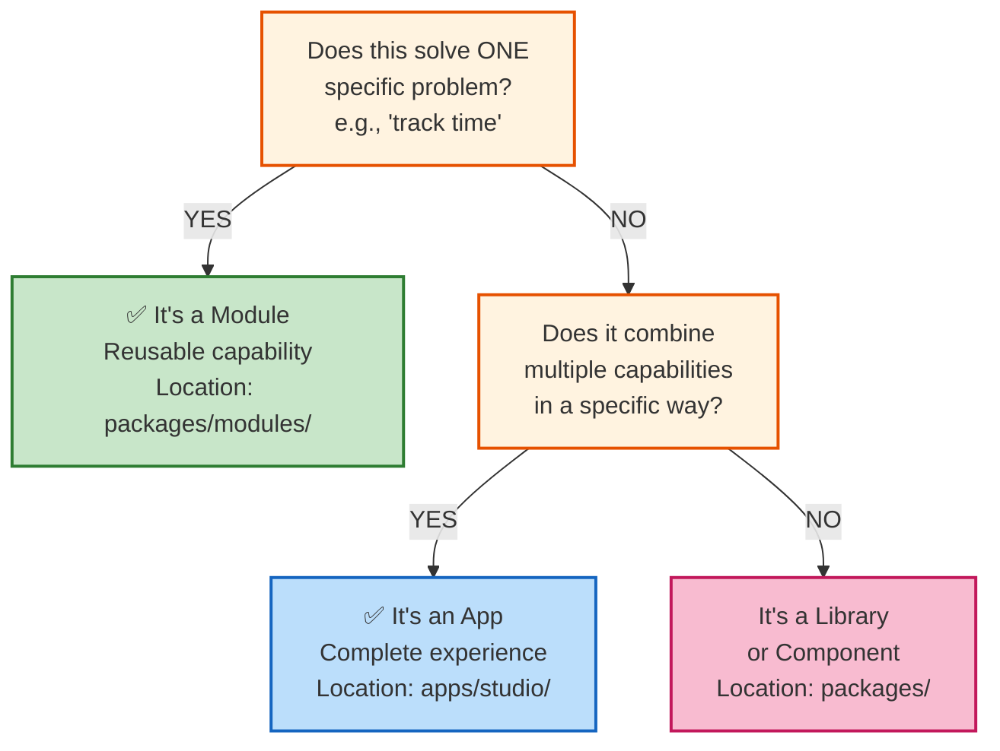
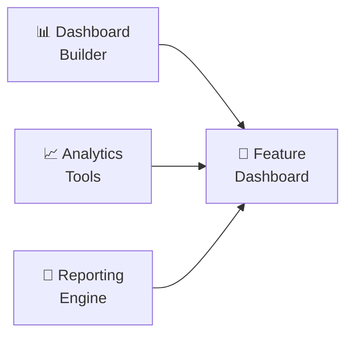
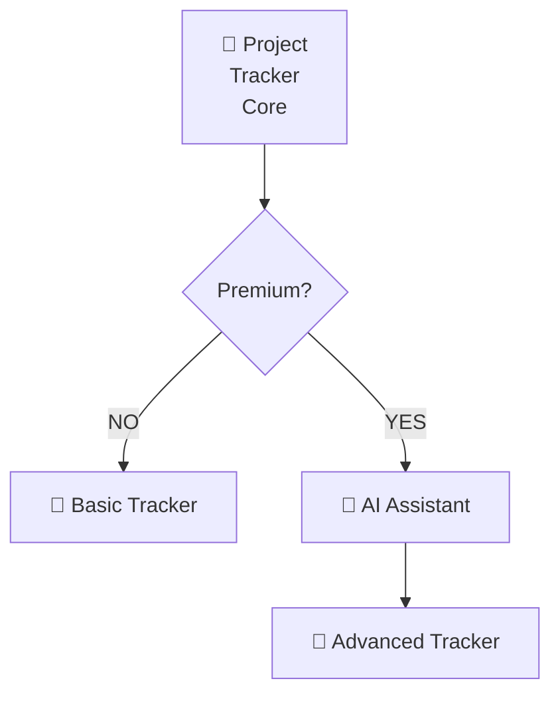
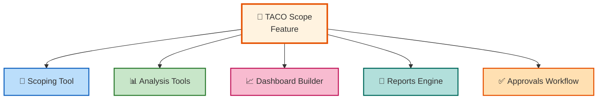

export const metadata = {
  title: 'Module Architecture & Classification: Building Reusable Capabilities',
  description: 'How AICodeRally organizes 130+ reusable modules, the Module vs. App distinction, and composition patterns for building complex applications'
}

# Module Architecture & Classification

**Last Updated:** 2025-12-03

AICodeRally uses a modular architecture to organize 130+ reusable capabilities. This guide explains how modules work, how they differ from full applications, and how to build with them.

## What is a Module?

**A Module is a reusable capability.** It's a self-contained piece of functionality that can be:
- Shared across multiple applications
- Combined with other modules
- Customized for specific use cases
- Built once, used many times

**Examples:**
- `accounting` - Financial calculations and tracking
- `approval-workflows` - Configurable approval processes
- `analytics-tools` - Data analysis and visualization
- `user-management` - User lifecycle management

---

## Module vs. Application: Key Distinction

**Use This Decision Tree:**



### Module Characteristics ✅

**What makes something a Module:**

| Criteria | Module | App |
|----------|--------|-----|
| **Solves one problem** | ✅ Yes | ❌ No (solves many) |
| **Reusable in multiple contexts** | ✅ Yes | ❌ Not typically |
| **Configuration, not hardcoding** | ✅ Yes | ❌ Often hardcoded |
| **Location** | `packages/modules/` | `apps/studio/` |
| **Shared in monorepo** | ✅ Yes | ❌ Specific app |
| **Multiple implementations** | ✅ Yes (variations) | ❌ One way |

### Application Characteristics 🎯

**What makes something an App:**

- Combines multiple modules/capabilities
- Specific user experience (UI, flows, pages)
- Dedicated purpose (e.g., "Sales Dashboard")
- Single implementation (not variations)
- Not reused elsewhere

**Example Studio App: "Birthday Party Planner"**
```
Uses These Modules:
├─ planning (core capability)
├─ calendar-management
├─ vendor-discovery
├─ payment-processing
├─ notifications
└─ reporting

Result: Specialized app, not reusable elsewhere
```

---

## Module Classification System

All 130+ modules are classified into categories:

### Classification Categories

#### 🔧 Core Modules (Keep & Reuse)
**103 core modules** - True reusable capabilities

**Characteristics:**
- Solves specific problem
- Used by multiple features
- Configurable and adaptable
- Location: `packages/modules/`

**Examples:**
- `approval-workflows` - Configurable approval processes
- `analytics-tools` - Data analysis
- `budget-management` - Budgeting system
- `dashboard-builder` - Customizable dashboards
- `email-marketing` - Campaign management
- `user-management` - User lifecycle

**Action:** Keep and prioritize

#### 🎨 Studio Apps (Migrate to apps/studio/)
**15 studio apps** - Full application experiences

**Characteristics:**
- Complete UI/UX
- Specific use case
- Not shared with other apps
- Full app bundle

**Examples:**
- `birthday-party-planner` - Plan parties
- `restaurant-weekly-menu-planner` - Menu planning
- `translation-app` - Language translation
- `future-builders` - Career planning
- `startup-forge` - Business planning

**Action:** Migrate from `packages/modules/` to `apps/studio/`

#### ⚠️ Edge-Portal Only
**Tier-specific features**

**Characteristics:**
- Only used in Edge portal
- Tier-specific UI
- Not shared in core modules

**Examples:**
- `ai-assistant-edge` - Edge tier AI
- Features specific to Edge tier

**Action:** Keep separate, don't export to shared modules

#### 🗂️ Legacy (Review & Consolidate)
**Requires review**

**Examples:**
- `taco-tracker-scoping` - Potential duplicate of `scoping`

**Action:** Audit for duplication, consolidate if needed

---

## Module Composition Patterns

**How modules combine to build features:**

### Pattern 1: Simple Addition



**Example:** Performance Dashboard combines UI + data analysis + export

### Pattern 2: Conditional Composition



**Example:** Basic vs. Premium project tracking with optional AI

### Pattern 3: Deep Composition (TACO Tracker Scope Example)



**Example:** Scoping app combines 5+ modules for complete experience

### Real Example: TACO Tracker Scope

```
taco-tracker-scoping combines:
├─ scoping-tool (core capability)
├─ analysis-tools (data analysis)
├─ dashboard-builder (UI)
├─ reporting-engine (exports)
└─ approval-workflows (approval gates)

Result: Complete scoping application
```

---

## Studio App Registry Integration

**How Studio apps reference modules:**

```
apps/studio/lib/apps.ts (Registry)
├─ birthday-party-planner
│  └─ uses: planning, calendar, vendors
├─ restaurant-menu-planner
│  └─ uses: content-calendar, vendor-discovery
├─ future-builders
│  └─ uses: project-tracker, goal-setting
└─ [20+ other studio apps]
```

Each Studio app:
1. Declares module dependencies
2. Gets auto-linked in Studio portal
3. Uses consistent UI/UX patterns
4. Shares common infrastructure

---

## Module Organization

**How modules are organized in monorepo:**

```
packages/modules/
├── accounting/                 # Financial capability
├── approval-workflows/         # Workflow capability
├── asset-library/              # Asset management
├── ...
└── user-management/            # User management
    ├── components/
    ├── hooks/
    ├── types.ts
    ├── index.ts
    └── package.json
```

**Standard Module Structure:**

```
module-name/
├── components/        # Reusable React components
├── hooks/            # Custom React hooks
├── types.ts          # TypeScript types
├── index.ts          # Public API export
├── README.md         # Documentation
└── package.json      # Module metadata
```

---

## Tier-Specific Modules

**Modules can be tier-specific:**

```
Core Modules (Available in all tiers)
├─ user-management
├─ analytics-tools
├─ reporting-engine
└─ [most modules]

Studio Tier
├─ All core modules
├─ Studio-specific UI
└─ Simplified versions

Edge Tier
├─ All core modules
├─ Advanced features
├─ Multi-user support
└─ ai-assistant-edge

Summit Tier
├─ All core modules
├─ Enterprise features
├─ Custom integrations
├─ Advanced governance
└─ Full customization
```

---

## Module Statistics

**Current Module Inventory (130 total):**

| Type | Count | Status |
|------|-------|--------|
| Core Modules | 103 | ✅ Keep |
| Studio Apps | 15 | 🔄 Migrate |
| Edge Tier Only | 5 | ⚠️ Review |
| Legacy | 7 | 🗂️ Consolidate |
| **TOTAL** | **130** | — |

### Coverage by Category

**Most Implemented Categories:**
- Financial: 8 modules (accounting, invoicing, budgets, etc.)
- Project Management: 7 modules (tracking, planning, etc.)
- User Management: 5 modules
- Analytics: 6 modules
- Workflow: 4 modules
- Content: 5 modules

---

## Best Practices

### When Creating a New Module ✅

1. **Solves one problem clearly** - Can you describe it in one sentence?
2. **Reusable in multiple contexts** - Could 2+ apps use it?
3. **Configurable** - Not hardcoded for one use case?
4. **Well-documented** - README with examples?
5. **Exported properly** - Clear public API in index.ts?

### When Creating a Studio App 🎯

1. **Combines multiple modules** - Uses 2+ modules?
2. **Specific use case** - Solves a particular problem?
3. **Complete experience** - UI, workflow, result?
4. **Located correctly** - In apps/studio/?
5. **Registered** - Listed in apps/studio/lib/apps.ts?

### Common Mistakes ❌

1. **Module does too much** - Combine multiple capabilities
2. **App is not reusable** - Created as module when it's an app
3. **Hardcoded for one use** - Module should be configurable
4. **No clear exports** - Unclear public API
5. **Tier-specific logic mixed in** - Should be at app level

---

## Module Consolidation Strategy

**Moving forward:**

```
Phase 1: Audit
├─ Review 15 misclassified studio apps
├─ Check 7 legacy modules
└─ Identify 3-5 duplicate capabilities

Phase 2: Migrate
├─ Move studio apps to apps/studio/
├─ Consolidate duplicates
├─ Update registry

Phase 3: Optimize
├─ 120+ core modules
├─ Clear composition patterns
├─ Reusable and maintainable
```

---

## Using Modules in Your App

**Importing a Module:**

```typescript
// app/components/MyFeature.tsx
import { AccountingDashboard } from '@rally/modules/accounting';
import { ApprovalWorkflow } from '@rally/modules/approval-workflows';

export function MyFeature() {
  return (
    <div>
      <ApprovalWorkflow
        steps={workflowSteps}
        onApprove={handleApprove}
      />
      <AccountingDashboard
        data={financialData}
        tier="summit"
      />
    </div>
  );
}
```

**Composing Modules:**

```typescript
// Build a custom dashboard
const Dashboard = () => {
  const [data, setData] = useState(null);

  return (
    <Layout>
      <AnalyticsTools data={data} />
      <ReportsEngine export={true} />
      <DashboardBuilder customize={true} />
    </Layout>
  );
};
```

---

## Related Documentation

- [Getting Started](/getting-started) - Initial setup
- [Modules Overview](/modules) - Module system
- [Architecture Overview](/architecture/unified) - System context
- [Development Guide](/development) - Building with modules
