export const metadata = {
  title: 'Architecture 3.0',
  description: 'Four-layer architecture for building AI-native business applications'
}

# AICodeRally Architecture 3.0

**Last Updated:** November 28, 2025
**Status:** Official Architecture

> **Note:** This page describes the **4-layer application architecture**. For the complete system including the **3-6-∞ Tier Framework** (Studio's 3 steps, Edge's 6 P's, Summit's ∞ extensions), see [Unified System Architecture](/architecture/unified) and [Franchise System](/franchise).

> Quick map for new work: [Master Context (Repo Map)](/architecture/master-context) — where Studio/Edge/Summit projects live and how to scaffold them.

AICodeRally is structured in **four logical layers** that provide clear separation of concerns and enable powerful reuse:

1. **Modules** – Capability library (internal only)
2. **Ideation Studio** – One idea → one app
3. **Edge Portal** – Business OS around your apps
4. **Summit Solutions** – Custom, cross-app, cross-business scale

---

## Architecture Diagram

```mermaid
graph TD
    A["🎯 Summit Solutions<br/>Custom, cross-app, cross-business<br/>governance, analytics, workflows"]
    B["🌐 Edge Portal<br/>Business OS around apps<br/>CRM, billing, ops, dashboards"]
    C["✨ Ideation Studio<br/>One idea → one app<br/>Focus on UX, value, basic data"]
    D["🔧 Modules<br/>Shared capabilities<br/>130+ internal modules<br/>Never exposed to users"]
    E["⚙️ Shared Infrastructure<br/>Next.js, TypeScript, Prisma, Vercel<br/>Tailwind, UI Components, Design System"]

    A -->|"builds on"| B
    B -->|"wraps"| C
    C -->|"uses"| D
    D -.->|"powered by"| E

    style A fill:#f9f,stroke:#333,stroke-width:2px,color:#000
    style B fill:#bbf,stroke:#333,stroke-width:2px,color:#000
    style C fill:#bfb,stroke:#333,stroke-width:2px,color:#000
    style D fill:#fbb,stroke:#333,stroke-width:2px,color:#000
    style E fill:#fdb,stroke:#333,stroke-width:2px,color:#000
```

**Interactive Architecture:** Each layer builds on the previous one, creating a complete ecosystem.

---

## Layer 1: Modules (Capability Library)

**Location:** `packages/modules/*`

**Responsibility:**
- Represent reusable business capabilities (donors, grants, pipeline, brand assets, etc.)
- Provide types, logic, and optional shared UI

**Consumers:**
- Studio apps
- Edge solutions
- Summit solutions

**Visibility:**
- Internal only – users never see "modules" in the UI

**Examples:**
- `donor-management`
- `grant-tracking`
- `pipeline-management`
- `brand-assets-library`
- `content-calendar`
- `campaigns-manager`
- `accounting`

---

## Layer 2: Ideation Studio – One Idea → One App

**Tagline:** *One Idea → One App*

**App:** `apps/studio` → `studio.aicoderally.com`

**Purpose:**
Take a single idea and turn it into a working app:
- Web app
- Website
- Mobile app (via the mobile project), if needed

**Scope:**
- Focus on one idea at a time:
  - Birthday planner
  - Club tracker
  - Simple CRM
  - Personal dashboard
- Focus on UX, forms, basic logic
- Not responsible for full business operations (billing, pipeline, etc.)

**Philosophy:**
Ideation Studio = "Give your idea shape."

**Output:**
A **single app** built from:
- Modules (your internal bricks)
- UI templates
- Flows
- Basic data structures

**Examples:**
- Birthday event app
- PTA signup app
- Brand lookbook app
- Simple client intake form
- Club roster app
- Mini nonprofit landing

**Tech Governance:**
- Studio apps = templates (blueprints)
- No business logic should live here
- Modules are imported, not implemented
- No multi-idea, multi-portal, or business context here
- Light UI, simple flows, guided creation, zero friction

**Code Location:**
- Studio apps live under `apps/studio/app/apps/*` (not "modules")
- Each folder is one Studio app blueprint

---

## Layer 3: Edge Portal – Business Wrapper Around Apps

**Tagline:** *Run the Business Around Your Ideas*

**App:** `apps/edge` → `edge.aicoderally.com`

**Purpose:**
Turn apps and modules into a **business portal**:
- Customers and accounts
- Billing
- Pipeline
- Projects and operations
- Dashboards and automations

**Scope:**
- May host multiple Studio apps for a single business
- Adds the "run the business" layer around those apps

**Philosophy:**
Edge Portal = "Turn your idea into an operation."

**Output:**
A **Business Portal** for the idea or multiple ideas:
- Dashboards
- Workflows
- Modules connected
- Permissions
- Template packs

**Examples of Edge Solutions:**
- `edge-designer-biz-kit` – for creative studios
- `edge-brand-hub` – for brand/marketing teams
- `edge-nonprofit-fundraiser` – for nonprofits
- `edge-restaurant-refresh` – for restaurants
- Internal: `edge-smb-starter` for small businesses

**Edge Portal uses:**
- Modules from `packages/modules/*`
- Edge solutions from `packages/solutions/*` (for vertical bundles)
- Shared UI from `@rally/ui`

**Tech Governance:**
- Edge is the **operational layer**, not the creative layer
- Edge uses modules to form **vertical solutions**
- Studio apps can be incorporated as "channels" or "features"
- Edge should NEVER define modules internally
- Edge should ALWAYS use module interfaces

---

## Layer 4: Summit Solutions – Custom, Cross-App, Cross-Business Scale

**Tagline:** *Custom. Cross-App. Cross-Business. Scale.*

**App:** `apps/summit` → `summit.aicoderally.com`

**Purpose:**
Provide custom solutions on top of multiple Edge portals, Studio apps, and modules:
- Cross-org analytics
- Governance
- Complex workflows
- Multi-entity logic
- Systems like SPM or comp governance

**Who it serves:**
- Enterprises
- Multi-location orgs
- Complex nonprofits
- Consulting/AI transformation clients
- Institutions
- Any org needing cross-idea or cross-business orchestration

**Philosophy:**
Summit = "Take everything you built and scale it across your team, org, or industry."

**Output:**
A **Summit Solution**, which may include:
- Bespoke modules (rare, but possible)
- Custom dashboards
- Cross-team workflows
- Multi-tenant data views
- Enterprise-grade governance
- AI agents coordinating across Edge portals
- Complex models, assessments, SPM systems

**Examples of Summit Solutions:**
- `summit-bhg-spm-suite` – SPM consulting platform
- `summit-enterprise-spm-accelerator` – Enterprise SPM governance

**Summit Solutions:**
- Live in `packages/solutions/*` as configuration
- Are implemented in `apps/summit` as views, flows, and orchestration
- Always build on top of:
  - Shared modules
  - Studio apps
  - Edge solutions
- Never re-implement modules directly

**Tech Governance:**
- Summit NEVER builds from scratch
- Summit ALWAYS:
  - Aggregates Studio apps
  - Aggregates Edge portals
  - Orchestrates modules
- Summit introduces:
  - Rules
  - Modeling
  - Automation that spans multiple edges
  - Compliance and governance
  - Executive-level dashboards

---

## The Superpower of This Structure

This naming + architecture gives you:

- A narrative anyone can understand
- A technically sane, scalable system
- Zero overlap between layers
- A clean value chain you can sell
- Clear boundaries for dev and AI agents
- Reuse of modules at every layer
- A perfect franchise story
- Zero naming confusion across the company
- A way to map "ideas → apps → business → enterprise"

The story is now as powerful as the code base.

---

## Architecture 3.0 Resources

**Core Framework Documentation:**

- **[3–6–∞ Framework](/architecture/3-6-infinity)** - Complete methodology: How ideas become apps, apps become businesses, and businesses scale
- **[Architecture 3.0 Release Notes](/architecture/release-notes)** - What changed in Architecture 3.0 and migration guide
- **[Architecture 3.0 Audit Checklist](/architecture/audit-checklist)** - Verify alignment with Architecture 3.0 standards

**System Documentation:**

- **[Unified System Architecture](/architecture/unified)** - Complete ecosystem overview (Rally Stack + Rally AI + Agent Protocol + Franchise)
- **[Franchise System](/franchise)** - Studio, Edge, Summit tiers with 3–6–∞ Framework

---

## Core Architecture Deep Dives

Detailed guides for key system components:

- **[AI Router: Intelligent Multi-Provider LLM Orchestration](/architecture/ai-router)** - Cost optimization, smart provider selection, caching (30-50% savings)
- **[Rally Project Engine: Human-in-the-Loop Orchestration](/architecture/project-engine)** - Project lifecycle, approval gates, task execution, feedback loops
- **[Module Architecture & Classification](/architecture/module-architecture)** - Building reusable capabilities, 130+ modules, tier-specific implementations

---

## Related Documentation

- **[Getting Started](/getting-started)** - Setup and first steps
- **[Platform Overview](/platform)** - Monorepo structure and tech stack
- **[Tech Stack Details](/tech-stack)** - Technology deep dive
- **[Module Reference](/modules)** - Browse all modules
- **[Deployment Guide](/deployment)** - Production deployment
- **[Prompt Library](/development/prompt-library)** - Architecture-aware AI prompt generators

---

## Technical Documentation

For deeper technical specifications, see the markdown files in the `architecture/` directory:

- `architecture/aicr-architecture-3.0.md` - Complete architecture specification
- `architecture/tech-stack.md` - Technology stack details
- `architecture/modules.md` - Module system documentation
- `architecture/ai-gateway-byok.md` - AI Gateway integration
