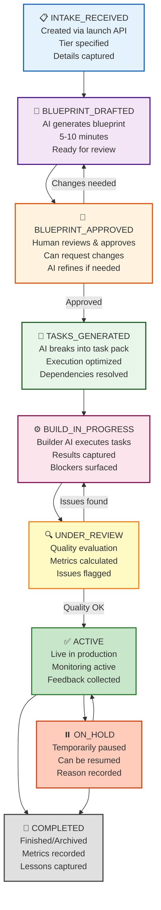

export const metadata = {
  title: 'Rally Project Engine: Human-in-the-Loop AI Project Orchestration',
  description: 'How AICodeRally manages projects from intake through completion with AI-assisted planning, human approval gates, and adaptive feedback'
}

# Rally Project Engine: Human-in-the-Loop AI Project Orchestration

**Last Updated:** 2025-12-03

The Rally Project Engine is the central orchestrator for managing AI-assisted projects in AICodeRally. It implements a human-in-the-loop workflow where AI generates proposals, humans review and approve, and the system executes with continuous feedback loops.

## Core Philosophy

**The Problem:**
- 100% manual project planning is slow
- 100% AI automation removes human judgment
- Need: AI speed + human oversight

**Our Solution:**
- AI generates blueprints quickly (minutes vs. hours)
- Humans review, approve, modify
- System executes approved tasks
- Continuous feedback improves future projects

---

## Project Lifecycle

Every project progresses through well-defined states:



**Project Flow:** From intake through approval gates to live execution and completion.

---

## Key Entities

### Project as First-Class Object

**What is a Project?**
A project is the central binding entity that connects:

```
┌─────────────────────────────────┐
│        Rally Project            │
├─────────────────────────────────┤
│ • Workspace context             │
│ • Tier assignment (tier 1/2/3)  │
│ • Business goals                │
│ • Constraints & requirements    │
│ • Team & roles                  │
│ • Budget & timeline             │
│ • Execution context             │
│ • Feedback history              │
│ • Quality metrics               │
└─────────────────────────────────┘
         ↓         ↓         ↓
    Blueprint   Tasks    Feedback
    (Plan)     (Build)   (Learn)
```

**Project Properties:**
- **Tier:** Studio (basic), Edge (advanced), Summit (enterprise)
- **Status:** Current state in lifecycle
- **Owner/Creator:** Who initiated the project
- **Collaborators:** Other team members
- **Blueprint:** AI-generated plan (text + structure)
- **Tasks:** Executable work items
- **Goals:** Business objectives
- **Constraints:** Limitations & rules
- **Metadata:** Tags, classifications, custom fields

---

### Human-in-the-Loop Approval Gates

**Gate 1: Blueprint Approval**

```
AI Generated Blueprint
        ↓
   Human Reviews
        ↓
   Decision Tree:
   ├─ Approve as-is → Proceed to tasks
   ├─ Request changes → AI refines, loop back
   ├─ Reject → Start over
   └─ Hold for later → Paused state
```

**What Humans Check:**
- Correctness of AI-generated plan
- Alignment with actual business goals
- Feasibility and resource availability
- Risk identification
- Compliance and policy alignment

**What AI Can't Do:**
- Business judgment and priorities
- Risk assessment and mitigation
- Policy and compliance decisions
- Stakeholder priorities
- Timeline negotiations

---

**Gate 2: Build Review**

```
Build Complete
        ↓
   Review Agent Evaluates:
   ├─ Quality metrics
   ├─ Error detection
   ├─ Performance benchmarks
   ├─ Compliance checks
   └─ Drift analysis
        ↓
   Human Decision:
   ├─ Accept → Go to ACTIVE
   ├─ Fix issues → Back to BUILD
   └─ Reject → Investigate
```

---

## Tiered Project Architecture

Projects scale across three tiers with increasing complexity:

### Studio Tier
- **Use Case:** Individual, simple projects
- **Complexity:** Basic execution
- **Typical Duration:** Days
- **Examples:**
  - Single-page analysis
  - Data processing task
  - Report generation
  - Template application

### Edge Tier
- **Use Case:** Team projects, moderate complexity
- **Complexity:** Multi-step workflows
- **Typical Duration:** Weeks
- **Examples:**
  - Custom application building
  - Multi-stage analysis
  - Integration projects
  - Client-facing solutions

### Summit Tier
- **Use Case:** Enterprise projects, high complexity
- **Complexity:** Multi-team, multi-system coordination
- **Typical Duration:** Months
- **Examples:**
  - Platform customization
  - Enterprise integrations
  - Multi-region deployments
  - Custom framework development

**Tier Progression:**
```
Studio Project
     ↓ (Can grow to)
  Edge Project
     ↓ (Can evolve to)
  Summit Project
```

---

## Task Card System

**What is a Task Card?**

Task cards are modular, executable work units:

```
Task Card {
  id: "task_123",
  title: "Analyze sales trends",
  description: "Process Q4 data...",
  cardType: "analysis",
  template: "sales-analysis-template",

  context: {
    projectGoal: "Understand customer patterns",
    constraints: ["Use only approved data sources"],
    successCriteria: ["Report accuracy > 95%"],
  },

  execution: {
    handler: "analysis-tool",
    params: { ... },
    timeout: 3600,
  },

  dependencies: ["task_122"],
  priority: "high",
  estimatedTime: "30 minutes",
}
```

**Task Properties:**
- **Card Type:** Analysis, data-processing, integration, etc.
- **Template:** Predefined card structure
- **Handler:** Which AI/system executes it
- **Context:** Project-specific information
- **Dependencies:** Other tasks required first
- **Success Criteria:** How to know it worked

**Execution Flow:**
```
1. Task selected (respecting dependencies)
2. Context injected (project goal, constraints)
3. Handler executes
4. Results captured
5. Quality checked
6. Next task triggered
```

---

## Feedback Loop & Continuous Improvement

**How Learning Works:**

```
Each Completed Project → Feedback Events
            ↓
    Feedback Summarized
    (Success, Issues, Times)
            ↓
    Stored in RAG System
    (Vector database)
            ↓
    Next Project Generation
    (Uses learned patterns)
            ↓
    Better Blueprints Over Time
```

**Feedback Captured:**
- What worked well (reuse patterns)
- What failed (avoid anti-patterns)
- Timing accuracy (improve estimates)
- User satisfaction (alignment score)
- Cost vs. benefit (efficiency metrics)

**Adaptive Suggestions:**
- Proposals get smarter with each project
- Common patterns learned automatically
- Edge cases documented and handled
- Best practices emerge from data

---

## Multi-Role Governance

**Project Roles & Permissions:**

| Role | Capabilities | Decision Authority |
|------|--------------|-------------------|
| **Owner** | Create, modify, delete project | All decisions |
| **Operator** | Approve/reject builds | Build approval |
| **Collaborator** | View, comment, suggest | Limited |
| **Client** | View progress, provide feedback | Blueprint feedback |
| **Reviewer** | Quality assessment | Build assessment |

**Approval Authority:**
```
Blueprint Approval:
  - Owner: Always can approve
  - Client: Can suggest changes
  - Operator: Can override if urgent

Build Approval:
  - Owner: Final authority
  - Operator: Can approve routine builds
  - Reviewer: Quality gate
```

---

## Quality Metrics & Drift Tracking

**Drift Index:**
Measures how far execution has deviated from plan:

```
Drift = (Planned - Actual) / Planned × 100%

Examples:
- Timeline drift: Project took 20% longer
- Quality drift: Output missed 10% of criteria
- Scope drift: Added 5 unplanned tasks
```

**Review Agent Continuously:**
- Evaluates output quality
- Updates drift index
- Flags anomalies
- Suggests corrections
- Predicts completion

---

## Integration with Task Cards

**How Tasks & Projects Connect:**

```
Project Blueprint
     ↓
  [Analysis needed]
     ↓
  Task Card 1 (Data gathering)
     ↓ (success)
  Task Card 2 (Processing)
     ↓ (success)
  Task Card 3 (Reporting)
     ↓ (all complete)
Project Status = Build Complete
     ↓
  Human Review
     ↓
Project Status = ACTIVE
```

**Example Project Flow:**

```
1. Create project: "Build Q4 sales dashboard"
2. AI generates blueprint with 5 major tasks
3. Human approves blueprint
4. System creates 12 task cards
5. Each task card executes in order:
   - Dashboard setup
   - Data import
   - Analytics processing
   - Visualization creation
   - Report generation
6. Review agent validates quality
7. Human approves build
8. Dashboard goes ACTIVE
```

---

## Best Practices

**✅ DO:**
- Provide clear project goals
- Review and approve blueprints before build
- Monitor progress during execution
- Provide feedback for future projects
- Use appropriate tier for complexity

**❌ DON'T:**
- Skip blueprint review (trust, but verify)
- Approve without understanding the plan
- Modify approved blueprints mid-execution
- Ignore quality issues during build
- Underestimate project complexity

---

## Related Documentation

- [Getting Started](/getting-started) - Project creation
- [Modules](/modules) - Reusable capabilities
- [Architecture Overview](/architecture/unified) - System context
- [Troubleshooting](/troubleshooting) - Common issues
